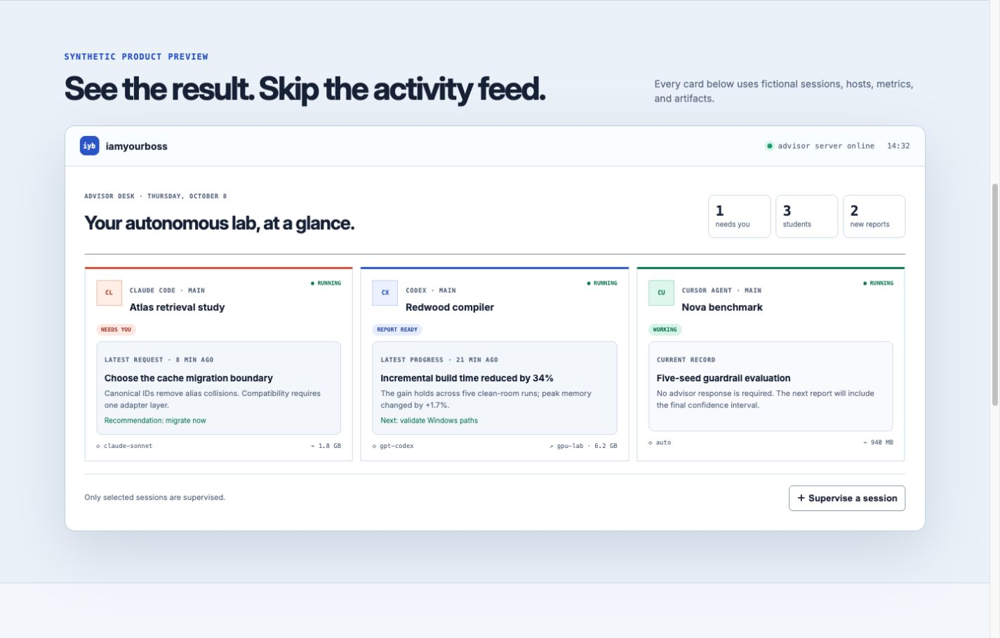

# iamyourboss

**Your coding agents work. You supervise.**

`iamyourboss` is a local advisor layer for autonomous coding sessions. Claude Code, Codex, Agy, and Cursor Agent keep working in their normal environments, but only send you synthesized findings, decisions, and final reports. The browser app is the permanent research record: goals, reports, requests, advisor directives, decisions, attachments, and session-level resource summaries.



The screenshot uses synthetic sessions, metrics, hosts, and artifacts.

No transcript, terminal stream, chain of thought, tool-call log, token counter, file browser, or task board is collected.

## Run it

Requires Node 22.5 or newer and at least one supported coding-agent CLI.

```bash
git clone https://github.com/CurryTang/iamyourboss.git
cd iamyourboss
npm install
npm install -g .
iyb install
```

Then open <http://127.0.0.1:7331>. `iyb install`:

- registers the `iamyourboss` MCP server with detected Claude Code, Codex, Agy, and Cursor Agent installations;
- adds the advisor behavior as a managed block in the host's global instruction file;
- installs each provider's lifecycle hooks so the exact conversation ID and pending advisor messages enter agent context;
- starts a persistent launchd user service on macOS or systemd user service on Linux, with a detached-process fallback.

The installer preserves unrelated instructions and hooks. `iyb uninstall` removes only `iamyourboss`-managed entries and leaves the research record on disk.

The dashboard discovers already-running local Claude Code, Codex, Agy, and Cursor Agent processes, but discovery is passive. A session receives no advisor prompt, research record, or hardware sampling until the user clicks **Supervise**. Supervision creates the session goal and requests one initial progress report. Provider session IDs from hooks are authoritative; process identity is only a fallback for sessions that predate installation. Nested agent processes are shown as subagents under their parent rather than counted as independent main students. Star a supervised session to keep it in the Core sessions section. Goals, reports, directives, decisions, and resource samples remain grouped under the same stable session.

Useful commands:

```bash
iyb dashboard   # start if needed and open the browser app
iyb status
iyb doctor
iyb serve       # foreground server, useful for development
iyb uninstall
```

For repository development:

```bash
npm test
npm start
```

## Agent behavior

The MCP surface is intentionally small:

| Tool | Purpose |
| --- | --- |
| `start_goal` | Register one substantive assignment for this agent session |
| `report` | Send an important non-blocking finding |
| `request` | Ask for a blocking or non-blocking advisor decision |
| `finish` | Submit the final synthesis and mark the goal done |
| `check_advisor` | Fallback inbox check; normal delivery happens through hooks or prompt dispatch |

The installed instruction tells the agent to report conclusions, not ordinary progress. Starting a goal is agent-initiated from the user's natural assignment; no wrapper command is required.

## Native plugin skills

The plugin bundle in `plugins/iamyourboss` includes eight focused skills. `iyb install` installs managed `iyb-*` copies into each provider's native global skill directory:

| Provider | Installed location |
| --- | --- |
| Claude Code | `~/.claude/skills/iyb-*` |
| Codex | `~/.codex/skills/iyb-*` |
| Cursor Agent | `~/.cursor/skills/iyb-*` |
| Agy | `~/.gemini/config/skills/iyb-*` |

The browser and ChatGPT skills are installed for Claude Code, Codex, and Cursor Agent. Agy receives the six reporting, artifact, writing, and resource skills.

| Skill | Purpose |
| --- | --- |
| `advisor-report` | Decide whether a result deserves an update, request, or final report |
| `progress-brief` | Turn an explicit advisor report request into one offline HTML progress artifact |
| `experiment-table` | Produce a compact, self-contained HTML result table |
| `experiment-figure` | Produce a self-contained HTML/SVG figure with exact values |
| `humanize-with-agy` | Remove AI-writing tells, optionally using Agy as an independent read-only editing pass |
| `resource-watch` | Bind exact local or SSH process trees to the supervised session |
| `chat-with-gpt` | Ask ChatGPT through an existing signed-in native browser session |
| `native-browser-control` | Use the coding host's native browser integration without a standalone automation profile |

HTML artifacts are rendered inline in a sandboxed dashboard frame with a restrictive content-security policy. They must be fully offline; external scripts, fonts, images, and network requests are blocked.

## Sending a prompt to a student

`Send prompt`, decision answers, and `Collect progress & TODO` target the exact registered session. A progress request asks the student to stop at a sensible point, synthesize its current conclusion, and attach one offline HTML artifact; it never asks for a log dump. Artifact language and the model used for subsequent dispatched turns can be selected per session. When the student is running inside Zellij or tmux, `iamyourboss` records its pane and injects the advisor turn there immediately. If the pane is no longer available, it falls back to the provider's resume transport:

| Provider | Resume transport |
| --- | --- |
| Claude Code | `claude --print --resume <session>` |
| Codex | `codex exec resume <session> <prompt>` |
| Agy | `agy --conversation <session> --print` |
| Cursor Agent | `cursor-agent --print --resume <session>` |

The Dashboard shows `queued`, `sending prompt`, `prompt delivered`, or `prompt failed`. A failed launch remains available to the provider hook on its next natural turn. Terminal content and resumed CLI stdout/stderr are not collected: responses enter the permanent record only when the coding agent deliberately calls `report`, `request`, or `finish`.

For already-running Claude sessions, the detector uses `claude agents --json` to bind the process to Claude's authoritative session ID and provider state (`busy` or `idle`) without reading its transcript. The server samples CPU, RAM, process count, and GPU memory for supervised running process trees every 10 seconds. Clicking **Stop** or **Stop supervising** stops new prompts and sampling while preserving reports, artifact IDs, timestamps, directives, and decisions.

Prompt dispatch never adds a provider's dangerous auto-approval flag. The resumed session keeps its configured permission and sandbox policy.

## Local and SSH resources

Resource visibility is scoped to each selected student session, not the whole machine. Every 10 seconds the MCP process samples the coding-agent process tree and records:

- current and peak resident memory;
- current CPU and estimated cumulative CPU core-hours;
- process count;
- NVIDIA GPU memory when `nvidia-smi` is available.

The system never stores process arguments, commands, terminal content, or file activity. Process metadata is used in memory only to identify descendants.

### Agent running directly on an SSH host

Forward a remote port back to the local advisor server, install/configure the MCP command on the remote host, and point it at the tunnel:

```bash
ssh -R 17331:127.0.0.1:7331 user@gpu-host
export IYB_URL=http://127.0.0.1:17331
export IYB_RESOURCE_SCOPE=remote
codex   # or claude
```

An ordinary SSH login also sets `SSH_CONNECTION`, so the sampler automatically labels that host as remote; `IYB_RESOURCE_SCOPE=remote` makes the intent explicit. Use a different forwarded remote port for concurrent users when needed.

### Local agent launching a remote job

Pass an explicit remote process tree when the agent registers the goal:

```json
{
  "remoteResources": [
    { "target": "user@gpu-host", "pid": 24810, "label": "gpu-a100-1" }
  ]
}
```

Sampling uses non-interactive SSH with a four-second connection timeout. Only the declared PID and its descendants are counted. The local coding-agent process tree remains visible beside the remote card.

## Architecture

```text
Claude Code / Codex / Agy / Cursor session
  ├─ discovery: process + provider identity + parent/subagent role
  ├─ MCP: goal, report, request, finish, attachments
  ├─ hook: pending directive → next model turn
  └─ sampler: local tree + explicitly bound SSH trees
                         │
                         ▼
                 localhost:7331
              HTTP API + SSE + files
                         │
             atomic research-record.json
                         │
                         ▼
                 browser advisor desk
```

The server is the only writer. It uses an atomic local JSON record and copies attachments into `~/.iamyourboss/attachments/`. This keeps installation dependency-free and makes the complete durable record inspectable and portable. Resource history is capped at 2,000 samples per goal; liveness outside the research record is disposable.

Dashboard status is derived with this precedence:

1. `DONE` after a final report;
2. `NEEDS YOU` for an unresolved blocking request;
3. `REPORT READY` for an unseen report;
4. `STALE` after the configured period without a meaningful report;
5. `WORKING` otherwise.

Set `IYB_STALE_MINUTES`, `IYB_PORT`, `IYB_HOST`, or `IYB_DATA_DIR` before starting the service to override defaults. The server binds to loopback by default and has no authentication; do not expose it directly to an untrusted network.

The static public homepage is in `landing/`. Its product preview is synthetic and can be served with:

```bash
python3 -m http.server 4173 --directory landing
```

Codex MCP and lifecycle-hook integration follows the current [official OpenAI Codex documentation](https://developers.openai.com/codex/hooks).

## Deliberate v1 boundaries

This implementation ships the requested advisor loop, browser app, attachments, Claude Code/Codex/Agy/Cursor integration, active prompt delivery, persistent local service, and local/SSH resource attribution. It deliberately does not include notification transports, OpenCode integration, multi-user auth, orchestration, project management, or arbitrary analytics. Those are separate slices only if they prove necessary for advisor attention.
